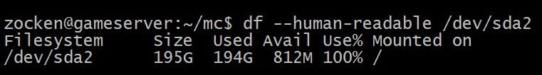

# python-backup-controller

The next generation of a backup script.

Intending to go one step further, from the old, well known daily cron task which just calls some `tar -czvf $(date).tar.gz data_folder/`. A more detailed list of goals can be found here: [goals.md](./goals.md).

# Motivation

Having regularly seen some `df` output like this:

.. and having lived through the experience of hastily trying to recover the system into a stable state, I want to improve it.  I have identified two major concerns which I believe are at the root of this:

- Too big backups
- Improper warnings/notifications

Regarding the first, I want to implement differential backups (backuping each file change which has changed since the last complete backup). Changed are noticed on changed MD5 checksums of the files. Why MD5? Because I like it from personal expierience.

Regarding the second, before each backup, we will try to guess the size of the next backup, based on previous backups. If the guess is bigger than the available storage capacity. No backup will be made. And a severe warning will be send out.  Also after each backup there will be made an estimation for the next differential and the next complete backup, if either of those would not be possible with the remaining space, similarly a warning will be send out too.

